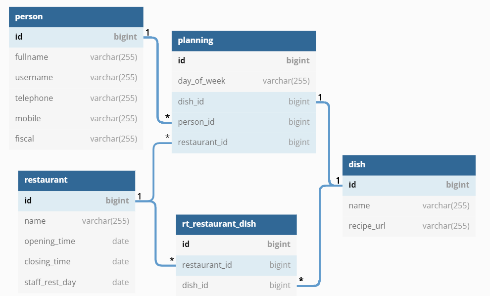
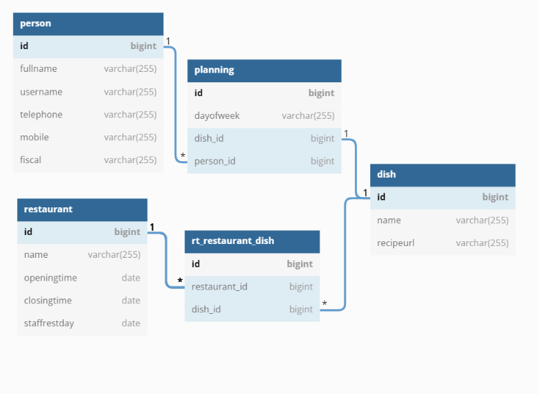

# People meals 
`by João Marcelo Renault`

## Setup
```docker
> To start mysql container
docker-compose up

> To start mysql container detached
docker-compose up -d
```
## Usage
```html
> With a browser, access: 
http://localhost:8088/
```
**Note:** It will be shared a dump of the database on mysql folder, on that dump you can create a dump of the database if you want to, and it will be loaded when the DB is loaded.

## Database schema plan
Following relationships were implemented:
* Person - one to many - Planning
* Restaurant - one to many - Planning
* Planning - one to one - Dish
* Restaurant - many to many - Dish



## Architecture
It was organized a service-oriented architecture as can be seen below


## REST APIs
* Dish Entity

`add a Dish entity to repository`
http://localhost:8080/api/v1/dishes/add (DishDTO body) 

`remove a Dish entity from repository`
http://localhost:8080/api/v1/dishes/remove/{dishId}

`update a Dish entity from repository`
http://localhost:8080/api/v1/dishes/update/{dishId} (DishDTO body)

* Person Entity

`add a Person entity to repository`
http://localhost:8080/api/v1/persons/add (PersonDTO body)

`remove a Person entity from repository`
http://localhost:8080/api/v1/persons/remove/{personId}

`update a Person entity from repository`
http://localhost:8080/api/v1/persons/update/{personId} (PersonDTO body) 

* Restaurant Entity

`add a Restaurant entity to repository:`
http://localhost:8080/api/v1/restaurants/add (restaurantDTO body)

`remove a Restaurant entity from repository`
http://localhost:8080/api/v1/restaurants/remove/{restaurantId}

`update a Restaurant entity from repository`
http://localhost:8080/api/v1/restaurants/update/{restaurantId} (DishDTO body)

* Planning Entity

`create a planning by associating Dish, Person, Restaurant and DayOfWeek`
http://localhost:8080/api/v1/plannings/associate (AssociateForm body)

`remove an existing Planning (previous association)`
http://localhost:8080/api/v1/plannings/disassociate (AssociateForm body)

`get a List of Persons in a specific Restaurant and DayOfWeek`
http://localhost:8080/api/v1/plannings/getPersonList/{restaurantId}/{dayOfWeek}/restaurant

`get a List of Persons with a specific Dish and DayOfWeek`
http://localhost:8080/api/v1/plannings/getPersonList/{dishId}/{dayOfWeek}/dish

`get a List of Persons that have no Dish in a DayOfWeek`
http://localhost:8080/api/v1/plannings/getPersonList/{dayOfWeek}/no_dish

## Testing
* There are Unit Tests for each method
* Postman collection for testing:
>https://www.postman.com/jucron/workspace/peoplemeals-endpoints-test-joo-renault/overview

## Work yet to be implemented 
* Documentation
* Integration tests
* Queries for repository use (reducing code amount - streams)
* Others (please suggest)