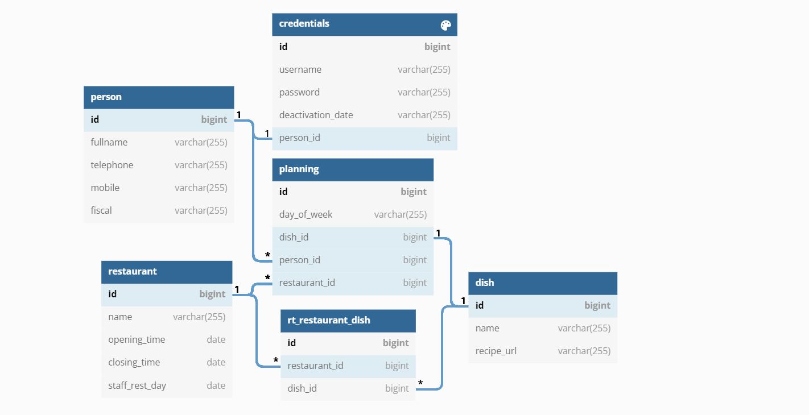
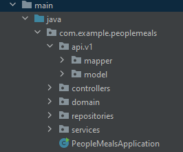
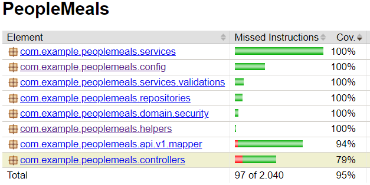

# People meals

`by João Marcelo Renault`

[](https://dl.circleci.com/status-badge/redirect/gh/jucron/PeopleMeals/tree/master)

## Setup via Docker

Requirement: Have Docker installed and make sure the
file [application.properties](src/main/resources/application.properties) have only active the
profile #2 dev.

```docker
> First you need to create an image of PeopleMeals application. From files directory, type:
$ docker build -t peoplemeals .

> Start all containers in detach mode by executing the following command:
$ docker-compose up -d

```

**Note:** There will be exposed the following in localhost:

* `MySQL container: 3306`
* `PeopleMeals application: 8080`

## Usage

```html
> With a browser, access: http://localhost:8088/
(or your local url)
```

**Note:** It will be shared a dump of the database on mysql folder, on that dump you can create a dump of the database
if you want to, and it will be loaded when the DB is loaded.

## Database schema plan

The Database schema plan, which explicits the Entities relationships, is the following:

[//]: # ()


## Architecture

It was organized a service-oriented architecture as can be seen below



## REST APIs

* Credentials Entity

[Credentials Controller documentation here](https://documenter.getpostman.com/view/18570764/UzBvFNHe)

* Login

[Login Controller documentation here](https://documenter.getpostman.com/view/18570764/UzBvFNMw)

* Dish Entity

[Dish Controller documentation here](https://documenter.getpostman.com/view/18570764/UzBvFNMv)

* Person Entity

[Person Controller documentation here](https://documenter.getpostman.com/view/18570764/UzBvFNMy)

* Restaurant Entity

[Restaurant Controller documentation here](https://documenter.getpostman.com/view/18570764/UzBvFNN2)

* Planning Entity

[Planning Controller documentation here](https://documenter.getpostman.com/view/18570764/UzBvFNN3)

## Testing

* There are Unit Tests for each method
* Two Integration Test were implemented:

> for processes that require Database use

> for Security authorization context environment

* Postman public WorksSpace for testing:

> [Postman - PeopleMeals endpoints Test](https://www.postman.com/jucron/workspace/peoplemeals-endpoints-test-joo-renault/overview)

* Code coverage report from JaCoCo plugin:



`Note: Classes with no practical reason to be tested were annotated with @NoCoverageGenerated`